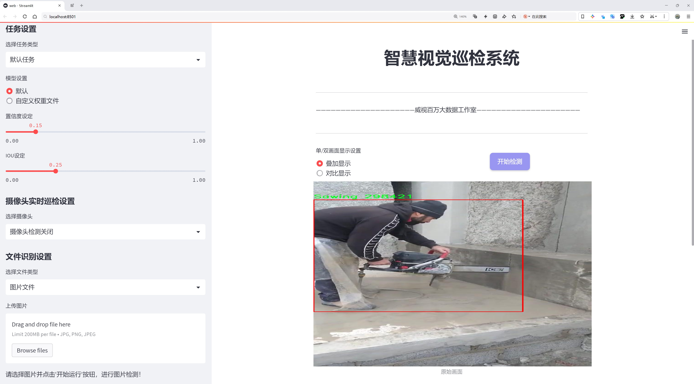
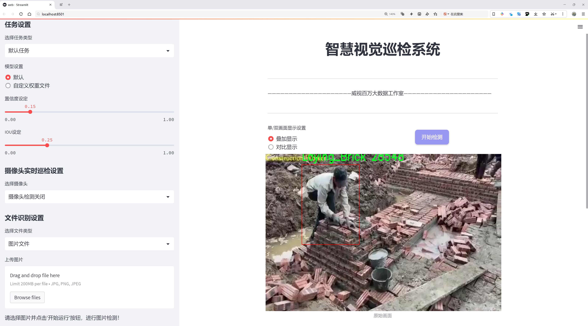
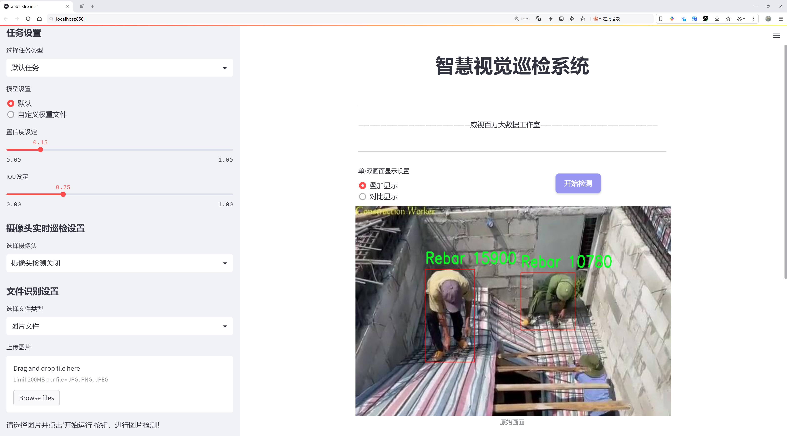
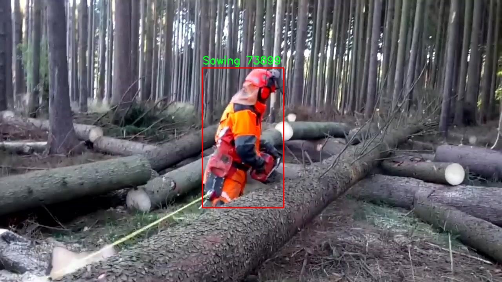
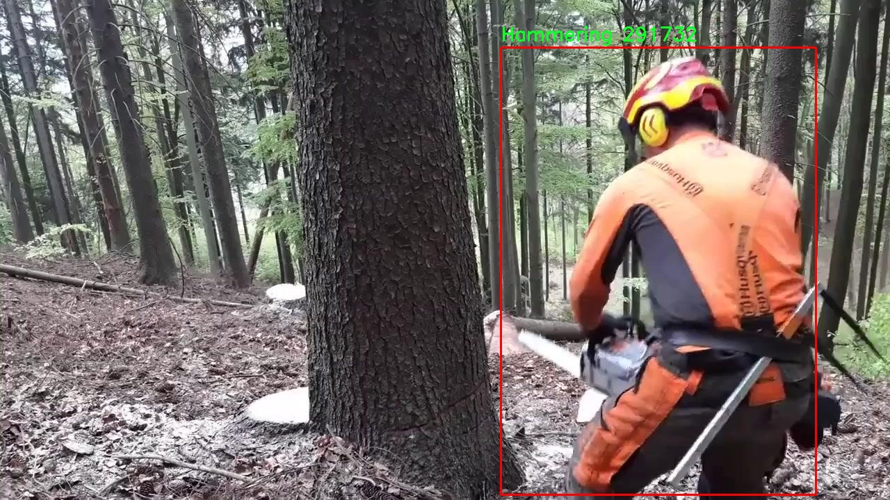
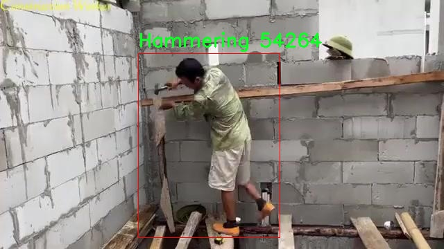
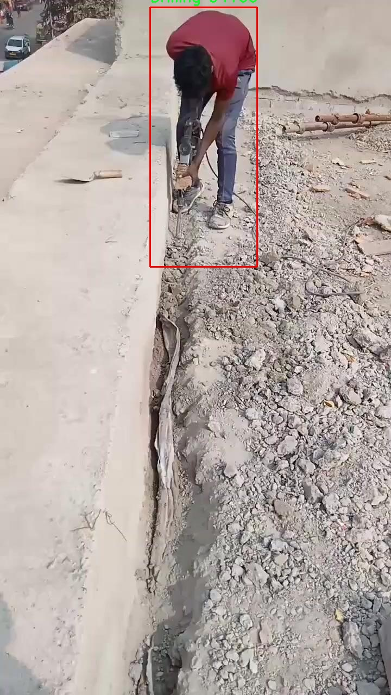

# 建筑工地作业类型工种岗位检测检测系统源码分享
 # [一条龙教学YOLOV8标注好的数据集一键训练_70+全套改进创新点发刊_Web前端展示]

### 1.研究背景与意义

项目参考[AAAI Association for the Advancement of Artificial Intelligence](https://gitee.com/qunshansj/projects)

项目来源[AACV Association for the Advancement of Computer Vision](https://gitee.com/qunmasj/projects)

研究背景与意义

随着城市化进程的加快，建筑行业在经济发展中扮演着越来越重要的角色。然而，建筑工地的作业安全与效率问题也日益凸显，成为亟待解决的挑战。传统的建筑工地管理往往依赖人工监督，不仅效率低下，而且容易受到人为因素的影响，导致安全隐患和资源浪费。因此，构建一个高效、智能的建筑工地作业类型工种岗位检测系统显得尤为重要。

近年来，计算机视觉技术的快速发展为建筑工地的智能化管理提供了新的解决方案。YOLO（You Only Look Once）系列目标检测算法因其高效性和实时性，广泛应用于各类物体检测任务中。YOLOv8作为该系列的最新版本，具备更强的检测精度和速度，能够在复杂环境中快速识别多种目标。通过对YOLOv8的改进，可以进一步提升其在建筑工地作业类型检测中的应用效果，从而实现对工种岗位的实时监控与管理。

本研究基于改进YOLOv8算法，构建一个专门针对建筑工地作业类型的检测系统。该系统的核心在于利用1900张标注图像和9个作业类别（如钻孔、锤击、砌砖、抹灰、钢筋、锯切、铲土、焊接等）进行训练和优化。通过深度学习模型的训练，系统能够自动识别不同工种的作业行为，实时监测工地的作业状态。这不仅可以提高工地管理的智能化水平，还能有效降低工地事故发生的风险，提升工人的安全意识。

此外，建筑工地作业类型的自动检测还有助于数据的积累与分析。通过对工地作业行为的监测，可以获取大量的作业数据，这些数据不仅可以用于实时监控，还可以为后续的工地管理决策提供依据。例如，通过分析不同工种的作业时间和效率，可以优化工序安排，提高资源利用率，降低施工成本。同时，系统还可以通过对作业行为的统计分析，发现潜在的安全隐患，为工地安全管理提供数据支持。

综上所述，基于改进YOLOv8的建筑工地作业类型工种岗位检测系统的研究，不仅具有重要的理论意义，也具有广泛的实际应用价值。它将推动建筑行业向智能化、数字化转型，为提升工地管理水平、保障工人安全、提高施工效率提供有效的技术支持。这一研究不仅是对计算机视觉技术在建筑领域应用的探索，更是对建筑行业未来发展的积极推动。通过本研究，期望能够为建筑工地的智能管理提供新的思路和方法，促进建筑行业的可持续发展。

### 2.图片演示







##### 注意：由于此博客编辑较早，上面“2.图片演示”和“3.视频演示”展示的系统图片或者视频可能为老版本，新版本在老版本的基础上升级如下：（实际效果以升级的新版本为准）

  （1）适配了YOLOV8的“目标检测”模型和“实例分割”模型，通过加载相应的权重（.pt）文件即可自适应加载模型。

  （2）支持“图片识别”、“视频识别”、“摄像头实时识别”三种识别模式。

  （3）支持“图片识别”、“视频识别”、“摄像头实时识别”三种识别结果保存导出，解决手动导出（容易卡顿出现爆内存）存在的问题，识别完自动保存结果并导出到tempDir中。

  （4）支持Web前端系统中的标题、背景图等自定义修改，后面提供修改教程。

  另外本项目提供训练的数据集和训练教程,暂不提供权重文件（best.pt）,需要您按照教程进行训练后实现图片演示和Web前端界面演示的效果。

### 3.视频演示

[3.1 视频演示](https://www.bilibili.com/video/BV189toe3EHv/)

### 4.数据集信息展示

##### 4.1 本项目数据集详细数据（类别数＆类别名）

nc: 8
names: ['Drilling', 'Hammering', 'Laying_Brick', 'Plastering', 'Rebar', 'Sawing', 'Shovelling', 'Welding']


##### 4.2 本项目数据集信息介绍

数据集信息展示

在本研究中，我们使用了名为“merge_project”的数据集，以支持改进YOLOv8的建筑工地作业类型工种岗位检测系统的训练和评估。该数据集专门设计用于捕捉和标注建筑工地上各种作业活动的图像数据，旨在提高计算机视觉模型在实际应用中的准确性和可靠性。数据集的类别数量为8，涵盖了建筑工地上常见的作业类型，具体包括：钻孔（Drilling）、锤击（Hammering）、砌砖（Laying_Brick）、抹灰（Plastering）、钢筋（Rebar）、锯切（Sawing）、铲土（Shovelling）和焊接（Welding）。这些类别不仅反映了建筑工地上不同工种的多样性，也为模型的训练提供了丰富的场景和任务。

“merge_project”数据集的构建过程经过精心设计，确保每个类别的样本数量均衡且多样化，以便模型能够在不同的环境和条件下学习到有效的特征。数据集中的图像来源于多个建筑工地，涵盖了不同的时间段、天气条件和施工阶段。这种多样性使得模型在面对现实世界中的各种变化时，能够具备更强的适应能力和鲁棒性。

在数据标注方面，所有图像均经过专业人员的仔细标注，确保每个作业类型的边界框准确无误。这种高质量的标注不仅提升了数据集的可靠性，也为后续的模型训练提供了坚实的基础。每个类别的样本均包含不同的视角和操作方式，例如，在锤击（Hammering）类别中，工人可能使用不同类型的锤子和工具进行操作，这些细微的差别都被精确地标注出来，以帮助模型学习到更为细致的特征。

为了确保模型的泛化能力，数据集还包含了一些具有挑战性的场景，例如工人之间的相互遮挡、复杂的背景以及不同的光照条件。这些因素都可能影响模型的检测性能，因此在数据集的构建过程中，特别注重了这些场景的采集和标注。通过引入这些复杂的情况，模型能够在训练过程中学习到更为复杂的特征，从而在实际应用中表现得更加出色。

在训练过程中，我们将“merge_project”数据集与YOLOv8模型相结合，利用其先进的深度学习架构进行特征提取和分类。YOLOv8的高效性和实时性使其成为建筑工地作业检测的理想选择，能够在保证检测精度的同时，实现快速响应。通过对“merge_project”数据集的充分利用，我们期望能够显著提升模型在建筑工地作业类型工种岗位检测中的表现，最终实现更为智能化的建筑施工管理。

综上所述，“merge_project”数据集不仅为本研究提供了丰富的训练素材，也为改进YOLOv8模型的应用奠定了坚实的基础。通过对数据集的深入分析和合理利用，我们相信可以有效提升建筑工地作业类型的检测精度，为建筑行业的智能化发展贡献一份力量。










### 5.全套项目环境部署视频教程（零基础手把手教学）

[5.1 环境部署教程链接（零基础手把手教学）](https://www.ixigua.com/7404473917358506534?logTag=c807d0cbc21c0ef59de5)


[5.2 安装Python虚拟环境创建和依赖库安装视频教程链接（零基础手把手教学）](https://www.ixigua.com/7404474678003106304?logTag=1f1041108cd1f708b01a)

### 6.手把手YOLOV8训练视频教程（零基础小白有手就能学会）

[6.1 手把手YOLOV8训练视频教程（零基础小白有手就能学会）](https://www.ixigua.com/7404477157818401292?logTag=d31a2dfd1983c9668658)

### 7.70+种全套YOLOV8创新点代码加载调参视频教程（一键加载写好的改进模型的配置文件）

[7.1 70+种全套YOLOV8创新点代码加载调参视频教程（一键加载写好的改进模型的配置文件）](https://www.ixigua.com/7404478314661806627?logTag=29066f8288e3f4eea3a4)

### 8.70+种全套YOLOV8创新点原理讲解（非科班也可以轻松写刊发刊，V10版本正在科研待更新）

由于篇幅限制，每个创新点的具体原理讲解就不一一展开，具体见下列网址中的创新点对应子项目的技术原理博客网址【Blog】：


[8.1 70+种全套YOLOV8创新点原理讲解链接](https://gitee.com/qunmasj/good)

### 9.系统功能展示（检测对象为举例，实际内容以本项目数据集为准）

图9.1.系统支持检测结果表格显示

  图9.2.系统支持置信度和IOU阈值手动调节

  图9.3.系统支持自定义加载权重文件best.pt(需要你通过步骤5中训练获得)

  图9.4.系统支持摄像头实时识别

  图9.5.系统支持图片识别

  图9.6.系统支持视频识别

  图9.7.系统支持识别结果文件自动保存

  图9.8.系统支持Excel导出检测结果数据


### 10.原始YOLOV8算法原理

原始YOLOv8算法原理

YOLOv8算法是YOLO系列的最新版本，代表了单阶段目标检测技术的一个重要进步。该算法在检测精度和速度方面均表现出色，广泛应用于实时目标检测任务。YOLOv8的网络结构由四个主要部分组成：输入端、骨干网络、颈部网络和头部网络。每个部分都经过精心设计，以优化特征提取和信息传递，从而提升整体性能。

在输入端，YOLOv8首先对输入图像进行预处理，包括Mosaic数据增强、自适应锚框计算和自适应灰度填充。这些预处理步骤旨在提高模型对不同场景和条件的适应能力。Mosaic增强通过将多张图像拼接在一起，生成新的训练样本，从而丰富了数据集的多样性，帮助模型更好地学习目标特征。自适应锚框计算则使得模型能够根据输入图像的特征动态调整锚框的大小和形状，增强了目标检测的灵活性。

YOLOv8的骨干网络采用了改进的DarkNet结构，特别是引入了C2f模块来替代传统的C3模块。C2f模块通过跨层连接和更多的分支设计，促进了梯度流动，增强了特征表示能力。这种设计使得模型在提取特征时能够更好地捕捉到不同尺度和不同层次的信息，从而提高了对复杂场景的理解能力。此外，SPPF（Spatial Pyramid Pooling Fusion）模块的引入，通过不同内核尺寸的池化操作，进一步增强了特征图的表达能力，为后续的特征融合奠定了基础。

颈部网络采用了路径聚合网络（PAN）结构，旨在加强不同尺度特征的融合能力。通过上采样和下采样的操作，PAN能够有效地整合来自不同层次的特征信息，确保语义信息和定位信息的有效传递。这种特征融合的方式使得YOLOv8在处理多尺度目标时表现得更加出色，尤其是在小目标检测方面。

在头部网络中，YOLOv8采用了解耦头结构，将分类和回归过程分开进行处理。这种设计的优势在于能够更灵活地调整分类和回归的损失计算，从而提高模型的收敛速度和检测精度。具体而言，YOLOv8使用Task-Aligned Assigner方法进行正负样本的匹配，依据分类和回归的分数加权结果选择正样本。这种方法确保了模型在训练过程中能够更有效地学习到目标的特征。

损失计算方面，YOLOv8在分类分支中采用了二元交叉熵损失（Binary Cross-Entropy Loss），而在回归分支中则结合了分布焦点损失（Distribution Focal Loss）和完全交并比损失（Complete Intersection over Union Loss）。这种损失函数的组合使得模型在边界框预测上更加精准，尤其是在面对复杂背景和小目标时，能够有效减少定位误差。

与之前的YOLO版本相比，YOLOv8在多个方面进行了优化。首先，新的骨干网络和头部网络设计显著提升了模型的性能，尤其是在特征提取和信息融合方面。其次，YOLOv8的解耦头结构和无锚框检测方法，减少了锚框预测的数量，提升了检测速度，并加速了非最大抑制（Non-Maximum Suppression, NMS）的过程。这些改进使得YOLOv8在实时目标检测任务中表现得更加高效。

尽管YOLOv8在检测精度和速度上取得了显著进展，但在某些复杂环境下仍然存在一些挑战。例如，在水面等复杂背景中，小目标的漂浮物特征可能会导致定位误差和目标感知能力不足。为了解决这些问题，研究者们正在探索进一步的改进方案，例如引入新的特征提取模块和损失函数，以提升模型的泛化能力和准确性。

总的来说，YOLOv8算法通过其创新的网络结构和优化的训练策略，为目标检测领域提供了一个强大的工具。它不仅在精度和速度上实现了突破，也为后续的研究和应用奠定了基础。随着技术的不断进步，YOLOv8及其衍生版本有望在更多实际场景中发挥重要作用，推动智能视觉技术的发展。


### 11.项目核心源码讲解（再也不用担心看不懂代码逻辑）

#### 11.1 code\ultralytics\utils\callbacks\tensorboard.py

以下是对代码的核心部分进行分析和详细注释的结果：

```python
# Ultralytics YOLO 🚀, AGPL-3.0 license

# 导入必要的库和模块
from ultralytics.utils import LOGGER, SETTINGS, TESTS_RUNNING, colorstr

try:
    # 尝试导入TensorBoard的SummaryWriter
    from torch.utils.tensorboard import SummaryWriter

    # 确保不在测试运行中
    assert not TESTS_RUNNING  
    # 确保TensorBoard集成已启用
    assert SETTINGS["tensorboard"] is True  
    WRITER = None  # 初始化TensorBoard的SummaryWriter实例

except (ImportError, AssertionError, TypeError, AttributeError):
    # 处理导入错误和断言错误
    SummaryWriter = None  # 如果导入失败，则将SummaryWriter设置为None


def _log_scalars(scalars, step=0):
    """将标量值记录到TensorBoard中。"""
    if WRITER:  # 如果WRITER已初始化
        for k, v in scalars.items():  # 遍历标量字典
            WRITER.add_scalar(k, v, step)  # 记录标量值


def _log_tensorboard_graph(trainer):
    """将模型图记录到TensorBoard中。"""
    try:
        import warnings
        from ultralytics.utils.torch_utils import de_parallel, torch

        imgsz = trainer.args.imgsz  # 获取输入图像大小
        imgsz = (imgsz, imgsz) if isinstance(imgsz, int) else imgsz  # 确保图像大小为元组
        p = next(trainer.model.parameters())  # 获取模型参数以确定设备和类型
        im = torch.zeros((1, 3, *imgsz), device=p.device, dtype=p.dtype)  # 创建一个零输入图像
        with warnings.catch_warnings():
            warnings.simplefilter("ignore", category=UserWarning)  # 忽略JIT跟踪警告
            WRITER.add_graph(torch.jit.trace(de_parallel(trainer.model), im, strict=False), [])  # 记录模型图
    except Exception as e:
        LOGGER.warning(f"WARNING ⚠️ TensorBoard图形可视化失败 {e}")  # 记录警告信息


def on_pretrain_routine_start(trainer):
    """在预训练例程开始时初始化TensorBoard记录。"""
    if SummaryWriter:  # 如果SummaryWriter可用
        try:
            global WRITER
            WRITER = SummaryWriter(str(trainer.save_dir))  # 初始化SummaryWriter
            prefix = colorstr("TensorBoard: ")
            LOGGER.info(f"{prefix}开始使用 'tensorboard --logdir {trainer.save_dir}'，可在 http://localhost:6006/ 查看。")
        except Exception as e:
            LOGGER.warning(f"WARNING ⚠️ TensorBoard未正确初始化，未记录此次运行。 {e}")  # 记录警告信息


def on_train_start(trainer):
    """在训练开始时记录TensorBoard图形。"""
    if WRITER:  # 如果WRITER已初始化
        _log_tensorboard_graph(trainer)  # 记录模型图


def on_train_epoch_end(trainer):
    """在训练周期结束时记录标量统计信息。"""
    _log_scalars(trainer.label_loss_items(trainer.tloss, prefix="train"), trainer.epoch + 1)  # 记录训练损失
    _log_scalars(trainer.lr, trainer.epoch + 1)  # 记录学习率


def on_fit_epoch_end(trainer):
    """在训练周期结束时记录周期指标。"""
    _log_scalars(trainer.metrics, trainer.epoch + 1)  # 记录训练指标


# 定义回调函数
callbacks = (
    {
        "on_pretrain_routine_start": on_pretrain_routine_start,
        "on_train_start": on_train_start,
        "on_fit_epoch_end": on_fit_epoch_end,
        "on_train_epoch_end": on_train_epoch_end,
    }
    if SummaryWriter  # 如果SummaryWriter可用
    else {}
)
```

### 代码核心部分分析
1. **导入模块**：代码首先导入了必要的模块，包括Ultralytics的工具和TensorBoard的SummaryWriter。
2. **错误处理**：通过try-except块处理可能的导入错误，确保在没有TensorBoard支持的情况下，代码能够正常运行。
3. **记录标量**：`_log_scalars`函数用于将训练过程中的标量数据（如损失和学习率）记录到TensorBoard。
4. **记录模型图**：`_log_tensorboard_graph`函数用于记录模型的计算图，帮助可视化模型结构。
5. **回调函数**：定义了一系列回调函数，这些函数在训练的不同阶段被调用，以记录训练过程中的信息。

### 总结
这段代码的核心功能是集成TensorBoard，以便在训练过程中记录和可视化模型的训练状态和性能指标。通过适当的回调机制，用户可以在训练的不同阶段获取有用的信息，帮助分析和调试模型。

这个文件是一个用于与TensorBoard集成的回调模块，主要用于在训练过程中记录和可视化模型的训练状态和性能指标。首先，它尝试从`torch.utils.tensorboard`导入`SummaryWriter`，这是TensorBoard的核心类，用于记录各种信息。如果导入失败，或者在测试运行时，或者TensorBoard集成未启用，则会捕获异常并将`SummaryWriter`设置为`None`。

在文件中定义了几个主要的函数。`_log_scalars`函数用于将标量值记录到TensorBoard，它接受一个字典类型的参数`scalars`，其中包含要记录的标量数据，以及一个可选的`step`参数，表示当前的训练步数。函数内部会遍历字典，将每个标量值添加到TensorBoard中。

`_log_tensorboard_graph`函数用于将模型的计算图记录到TensorBoard。它首先获取输入图像的大小，并创建一个全零的张量作为输入。然后使用`torch.jit.trace`来追踪模型的前向传播过程，并将生成的计算图添加到TensorBoard中。如果在这个过程中发生异常，会记录警告信息。

`on_pretrain_routine_start`函数在训练前的例程开始时被调用，用于初始化TensorBoard的记录器。它会创建一个`SummaryWriter`实例，并输出一条信息，提示用户如何启动TensorBoard并查看日志。

`on_train_start`函数在训练开始时被调用，主要用于记录模型的计算图。

`on_train_epoch_end`和`on_fit_epoch_end`函数分别在每个训练周期结束时被调用，用于记录训练损失和学习率，以及训练过程中的其他指标。

最后，文件定义了一个`callbacks`字典，其中包含了上述回调函数，只有在成功导入`SummaryWriter`的情况下才会填充这个字典。这个字典可以在训练过程中被调用，以便在不同的训练阶段记录相关信息。

总体来说，这个文件为YOLO模型的训练过程提供了一个灵活的TensorBoard集成方案，方便用户监控训练进度和模型性能。

#### 11.2 code\ultralytics\solutions\speed_estimation.py


这个程序文件是一个用于实时视频流中对象速度估计的类，名为 `SpeedEstimator`。它利用对象跟踪技术来计算在特定区域内移动对象的速度。程序的主要功能包括初始化参数、提取跟踪信息、存储跟踪数据、绘制边界框和轨迹、计算速度以及显示结果。

在类的初始化方法中，设置了一些默认值，包括图像信息、区域信息、预测和跟踪信息、速度估计信息等。`reg_pts` 定义了速度计算的区域，`trk_history` 用于存储每个对象的跟踪历史。`dist_data` 字典用于存储每个对象的速度数据。

`set_args` 方法允许用户配置速度估计和显示参数，如区域点、对象类别名称、显示图像的标志、线条厚度等。如果未提供区域点，则使用默认值。

`extract_tracks` 方法从给定的跟踪数据中提取边界框、类别和跟踪ID。`store_track_info` 方法用于存储每个对象的跟踪数据，包括计算边界框中心并更新跟踪历史。

`plot_box_and_track` 方法负责绘制对象的边界框和轨迹，并在图像上显示速度标签。速度标签根据对象的速度数据进行更新，边界框的颜色也会根据对象的速度状态进行变化。

`calculate_speed` 方法用于计算对象的速度。它检查对象的最新位置是否在定义的区域内，并根据时间差和位置差计算速度。如果对象在已知方向上移动，且之前有记录的时间和位置，则更新速度数据。

`estimate_speed` 方法是整个类的核心，负责处理输入图像和跟踪数据。它提取跟踪信息，绘制区域和对象的边界框，计算速度，并在需要时显示图像。

最后，`display_frames` 方法用于显示当前帧的图像，用户可以通过按下“q”键退出显示。

整体而言，这个程序实现了一个简单而有效的速度估计系统，能够在视频流中实时跟踪和计算对象的速度，适用于监控、交通分析等场景。

#### 11.2 ui.py

以下是保留的核心代码部分，并添加了详细的中文注释：

```python
import sys
import subprocess

def run_script(script_path):
    """
    使用当前 Python 环境运行指定的脚本。

    Args:
        script_path (str): 要运行的脚本路径

    Returns:
        None
    """
    # 获取当前 Python 解释器的路径
    python_path = sys.executable

    # 构建运行命令，使用 streamlit 运行指定的脚本
    command = f'"{python_path}" -m streamlit run "{script_path}"'

    # 执行命令，并等待其完成
    result = subprocess.run(command, shell=True)
    
    # 检查命令执行的返回码，如果不为0，表示执行出错
    if result.returncode != 0:
        print("脚本运行出错。")

# 实例化并运行应用
if __name__ == "__main__":
    # 指定要运行的脚本路径
    script_path = "web.py"  # 假设脚本在当前目录下

    # 调用函数运行脚本
    run_script(script_path)
```

### 代码注释说明：
1. **导入模块**：
   - `sys`：用于访问与 Python 解释器相关的变量和函数。
   - `subprocess`：用于创建新进程、连接到它们的输入/输出/错误管道，并获取返回码。

2. **`run_script` 函数**：
   - 接受一个参数 `script_path`，表示要运行的 Python 脚本的路径。
   - 使用 `sys.executable` 获取当前 Python 解释器的路径，以确保使用正确的 Python 环境。
   - 构建一个命令字符串，使用 `streamlit` 模块运行指定的脚本。
   - 使用 `subprocess.run` 执行构建的命令，并等待其完成。
   - 检查命令的返回码，如果返回码不为0，表示脚本运行出错，打印错误信息。

3. **主程序部分**：
   - 在 `__main__` 块中，指定要运行的脚本路径（假设脚本名为 `web.py`）。
   - 调用 `run_script` 函数来执行指定的脚本。

这个程序文件名为 `ui.py`，其主要功能是使用当前的 Python 环境来运行一个指定的脚本，具体是通过 Streamlit 框架来启动一个 Web 应用。

程序首先导入了必要的模块，包括 `sys`、`os` 和 `subprocess`，这些模块分别用于访问 Python 解释器的相关信息、处理文件和目录操作，以及执行外部命令。接着，从 `QtFusion.path` 模块中导入了 `abs_path` 函数，这个函数的作用是获取文件的绝对路径。

在 `run_script` 函数中，程序接受一个参数 `script_path`，这是要运行的脚本的路径。函数首先获取当前 Python 解释器的路径，并将其存储在 `python_path` 变量中。然后，构建一个命令字符串 `command`，这个命令会调用 Streamlit 来运行指定的脚本。命令的格式是：`python -m streamlit run "script_path"`。

接下来，使用 `subprocess.run` 方法来执行这个命令。`shell=True` 参数表示命令将在一个新的 shell 中执行。函数检查命令的返回码，如果返回码不为 0，表示脚本运行过程中出现了错误，此时会打印出“脚本运行出错。”的提示信息。

在文件的最后部分，程序通过 `if __name__ == "__main__":` 语句来判断当前模块是否是主程序。若是，则指定要运行的脚本路径为 `web.py`，并调用 `run_script` 函数来执行这个脚本。

总体来说，这个程序的目的是为了方便地在当前 Python 环境中启动一个 Streamlit Web 应用，通过指定脚本路径来实现动态运行。

#### 11.3 70+种YOLOv8算法改进源码大全和调试加载训练教程（非必要）\ultralytics\models\yolo\classify\__init__.py

```python
# 导入Ultralytics YOLO库中的分类模型相关模块
# Ultralytics YOLO 🚀, AGPL-3.0 license

# 从ultralytics.models.yolo.classify.predict模块导入分类预测器
from ultralytics.models.yolo.classify.predict import ClassificationPredictor

# 从ultralytics.models.yolo.classify.train模块导入分类训练器
from ultralytics.models.yolo.classify.train import ClassificationTrainer

# 从ultralytics.models.yolo.classify.val模块导入分类验证器
from ultralytics.models.yolo.classify.val import ClassificationValidator

# 定义模块的公开接口，包含分类预测器、分类训练器和分类验证器
__all__ = 'ClassificationPredictor', 'ClassificationTrainer', 'ClassificationValidator'
```

### 代码注释说明：
1. **导入模块**：
   - `ClassificationPredictor`：用于进行分类预测的类，能够根据输入的数据进行分类。
   - `ClassificationTrainer`：用于训练分类模型的类，负责模型的训练过程。
   - `ClassificationValidator`：用于验证分类模型性能的类，通常在训练后使用以评估模型的准确性。

2. **`__all__` 变量**：
   - 该变量定义了模块的公共接口，只有在使用 `from module import *` 时，列出的类才会被导入。这是一种控制模块导出内容的方式，确保只暴露必要的部分。

这个程序文件是一个Python模块的初始化文件，位于Ultralytics YOLO项目的分类模型目录下。文件的主要功能是导入与分类相关的预测、训练和验证类，并将它们暴露给模块的外部使用。

首先，文件开头的注释表明该项目使用的是AGPL-3.0许可证，属于Ultralytics YOLO系列。这是一个流行的目标检测和分类算法，广泛应用于计算机视觉领域。

接下来，文件通过`from`语句导入了三个关键的类：`ClassificationPredictor`、`ClassificationTrainer`和`ClassificationValidator`。这些类分别负责分类模型的预测、训练和验证过程。具体来说：

- `ClassificationPredictor`类用于进行图像分类的预测，能够对输入的图像进行处理并输出分类结果。
- `ClassificationTrainer`类负责模型的训练过程，包括数据加载、模型优化等步骤，以提高分类模型的性能。
- `ClassificationValidator`类用于验证训练好的模型，评估其在测试集上的表现，确保模型的准确性和鲁棒性。

最后，`__all__`变量定义了模块的公共接口，指定了在使用`from module import *`语句时，哪些类会被导入。这里列出的三个类使得用户可以方便地使用这些功能，而不需要直接访问模块内部的实现细节。

总的来说，这个初始化文件为YOLOv8的分类功能提供了一个清晰的接口，使得用户能够轻松地进行图像分类的预测、训练和验证。

#### 11.4 code\ultralytics\utils\files.py

以下是代码中最核心的部分，并附上详细的中文注释：

```python
import os
from pathlib import Path
from contextlib import contextmanager

@contextmanager
def spaces_in_path(path):
    """
    处理路径中包含空格的上下文管理器。如果路径包含空格，则用下划线替换空格，
    复制文件/目录到新路径，执行上下文代码块，然后将文件/目录复制回原位置。

    参数:
        path (str | Path): 原始路径。

    返回:
        (Path): 如果路径中有空格，则返回替换了空格的临时路径，否则返回原始路径。
    """
    if " " in str(path):
        path = Path(path)  # 将路径转换为Path对象
        with tempfile.TemporaryDirectory() as tmp_dir:  # 创建临时目录
            tmp_path = Path(tmp_dir) / path.name.replace(" ", "_")  # 替换空格为下划线

            # 复制文件或目录
            if path.is_dir():
                shutil.copytree(path, tmp_path)  # 复制目录
            elif path.is_file():
                shutil.copy2(path, tmp_path)  # 复制文件

            try:
                yield tmp_path  # 返回临时路径
            finally:
                # 将文件/目录复制回原位置
                if tmp_path.is_dir():
                    shutil.copytree(tmp_path, path, dirs_exist_ok=True)
                elif tmp_path.is_file():
                    shutil.copy2(tmp_path, path)

    else:
        yield path  # 如果没有空格，直接返回原始路径


def increment_path(path, exist_ok=False, sep="", mkdir=False):
    """
    增加文件或目录路径，即将路径后面加上数字，例如 runs/exp --> runs/exp{sep}2, runs/exp{sep}3 等。

    如果路径存在且 exist_ok 未设置为 True，则路径将通过在路径末尾附加数字和分隔符进行递增。
    如果路径是文件，则保留文件扩展名；如果路径是目录，则直接在路径末尾附加数字。
    如果 mkdir 设置为 True，则如果路径不存在，将创建该目录。

    参数:
        path (str, pathlib.Path): 要递增的路径。
        exist_ok (bool, optional): 如果为 True，则路径不会递增，直接返回原路径。默认为 False。
        sep (str, optional): 路径和递增数字之间使用的分隔符。默认为 ''。
        mkdir (bool, optional): 如果路径不存在，则创建目录。默认为 False。

    返回:
        (pathlib.Path): 递增后的路径。
    """
    path = Path(path)  # 将路径转换为Path对象
    if path.exists() and not exist_ok:
        path, suffix = (path.with_suffix(""), path.suffix) if path.is_file() else (path, "")

        # 方法1：递增路径
        for n in range(2, 9999):
            p = f"{path}{sep}{n}{suffix}"  # 生成递增路径
            if not os.path.exists(p):
                break
        path = Path(p)

    if mkdir:
        path.mkdir(parents=True, exist_ok=True)  # 创建目录

    return path  # 返回递增后的路径
```

### 代码核心部分解释：
1. **`spaces_in_path`**：这是一个上下文管理器，用于处理路径中包含空格的情况。它会在执行代码块之前将路径中的空格替换为下划线，并在执行完后将文件或目录复制回原位置。

2. **`increment_path`**：这个函数用于递增文件或目录的路径。如果路径已经存在，则会在路径后附加一个数字（例如 `exp` 变为 `exp2`），以避免路径冲突。它还可以选择创建目录。

这些功能在文件和目录管理中非常实用，尤其是在处理路径时可能会遇到的常见问题。

这个程序文件 `code\ultralytics\utils\files.py` 是一个用于处理文件和目录的实用工具模块，主要用于与文件系统交互，提供了一些便捷的功能。以下是对文件中各个部分的详细说明。

首先，文件导入了一些必要的模块，包括 `contextlib`、`glob`、`os`、`shutil`、`tempfile`、`datetime` 和 `pathlib`。这些模块提供了处理文件和目录、上下文管理、时间日期等功能。

接下来定义了一个 `WorkingDirectory` 类，它是一个上下文管理器，允许用户在指定的工作目录中执行代码。通过使用 `@WorkingDirectory(dir)` 装饰器或 `with WorkingDirectory(dir):` 语句，用户可以方便地改变当前工作目录。该类在初始化时保存了新的工作目录和当前目录，在进入上下文时切换到新的目录，退出时恢复到原来的目录。

然后，定义了一个 `spaces_in_path` 的上下文管理器，用于处理路径中包含空格的情况。如果路径中有空格，它会将空格替换为下划线，并将文件或目录复制到一个临时路径中。在执行上下文代码块后，它会将文件或目录复制回原来的位置。这个功能可以帮助避免在处理文件时因路径中包含空格而导致的问题。

接下来是 `increment_path` 函数，它用于递增文件或目录的路径。如果指定的路径已经存在，且 `exist_ok` 参数为 `False`，它会在路径后面添加一个数字后缀（例如 `runs/exp2`、`runs/exp3` 等）。如果路径是文件，它会保留文件扩展名；如果是目录，则直接在路径后追加数字。如果 `mkdir` 参数为 `True`，则会在路径不存在时创建该目录。

接下来是 `file_age` 函数，它返回自上次文件更新以来的天数。通过获取文件的最后修改时间戳并与当前时间进行比较，计算出文件的年龄。

然后是 `file_date` 函数，它返回文件的最后修改日期，格式为“年-月-日”，便于人类阅读。

接着是 `file_size` 函数，它返回指定文件或目录的大小（以MB为单位）。如果路径是文件，则直接返回文件大小；如果是目录，则递归计算目录中所有文件的总大小。

最后，定义了 `get_latest_run` 函数，它返回指定目录中最新的 `last.pt` 文件的路径。通过使用 `glob` 模块查找匹配的文件，并根据创建时间返回最新的文件路径，这在训练模型时用于恢复最近的训练状态。

总体来说，这个模块提供了一系列便捷的工具函数和上下文管理器，旨在简化文件和目录的操作，尤其是在机器学习和深度学习的上下文中。

#### 11.5 train.py

以下是代码中最核心的部分，并附上详细的中文注释：

```python
class DetectionTrainer(BaseTrainer):
    """
    DetectionTrainer类，继承自BaseTrainer类，用于基于检测模型的训练。
    """

    def build_dataset(self, img_path, mode="train", batch=None):
        """
        构建YOLO数据集。

        参数:
            img_path (str): 包含图像的文件夹路径。
            mode (str): 模式，可以是'train'或'val'，用户可以为每种模式自定义不同的数据增强。
            batch (int, optional): 批次大小，仅用于'rect'模式。默认为None。
        """
        gs = max(int(de_parallel(self.model).stride.max() if self.model else 0), 32)
        return build_yolo_dataset(self.args, img_path, batch, self.data, mode=mode, rect=mode == "val", stride=gs)

    def get_dataloader(self, dataset_path, batch_size=16, rank=0, mode="train"):
        """构造并返回数据加载器。"""
        assert mode in ["train", "val"]  # 确保模式是'train'或'val'
        with torch_distributed_zero_first(rank):  # 在分布式训练中，仅初始化数据集一次
            dataset = self.build_dataset(dataset_path, mode, batch_size)  # 构建数据集
        shuffle = mode == "train"  # 训练模式下打乱数据
        if getattr(dataset, "rect", False) and shuffle:
            LOGGER.warning("WARNING ⚠️ 'rect=True'与DataLoader的shuffle不兼容，设置shuffle=False")
            shuffle = False
        workers = self.args.workers if mode == "train" else self.args.workers * 2  # 根据模式设置工作线程数
        return build_dataloader(dataset, batch_size, workers, shuffle, rank)  # 返回数据加载器

    def preprocess_batch(self, batch):
        """对一批图像进行预处理，包括缩放和转换为浮点数。"""
        batch["img"] = batch["img"].to(self.device, non_blocking=True).float() / 255  # 将图像转移到设备并归一化
        if self.args.multi_scale:  # 如果启用多尺度
            imgs = batch["img"]
            sz = (
                random.randrange(self.args.imgsz * 0.5, self.args.imgsz * 1.5 + self.stride)
                // self.stride
                * self.stride
            )  # 随机选择图像大小
            sf = sz / max(imgs.shape[2:])  # 计算缩放因子
            if sf != 1:  # 如果缩放因子不为1
                ns = [
                    math.ceil(x * sf / self.stride) * self.stride for x in imgs.shape[2:]
                ]  # 计算新的形状
                imgs = nn.functional.interpolate(imgs, size=ns, mode="bilinear", align_corners=False)  # 进行插值
            batch["img"] = imgs  # 更新批次图像
        return batch

    def get_model(self, cfg=None, weights=None, verbose=True):
        """返回YOLO检测模型。"""
        model = DetectionModel(cfg, nc=self.data["nc"], verbose=verbose and RANK == -1)  # 创建检测模型
        if weights:
            model.load(weights)  # 加载权重
        return model

    def get_validator(self):
        """返回YOLO模型验证器。"""
        self.loss_names = "box_loss", "cls_loss", "dfl_loss"  # 定义损失名称
        return yolo.detect.DetectionValidator(
            self.test_loader, save_dir=self.save_dir, args=copy(self.args), _callbacks=self.callbacks
        )  # 返回验证器

    def plot_training_samples(self, batch, ni):
        """绘制带有注释的训练样本。"""
        plot_images(
            images=batch["img"],
            batch_idx=batch["batch_idx"],
            cls=batch["cls"].squeeze(-1),
            bboxes=batch["bboxes"],
            paths=batch["im_file"],
            fname=self.save_dir / f"train_batch{ni}.jpg",
            on_plot=self.on_plot,
        )  # 绘制图像

    def plot_metrics(self):
        """从CSV文件绘制指标。"""
        plot_results(file=self.csv, on_plot=self.on_plot)  # 保存结果图像
```

### 代码核心部分解释：
1. **DetectionTrainer类**：这是一个用于训练YOLO检测模型的类，继承自基本训练器`BaseTrainer`。
2. **build_dataset方法**：用于构建YOLO数据集，支持训练和验证模式。
3. **get_dataloader方法**：构造数据加载器，负责数据的加载和预处理。
4. **preprocess_batch方法**：对图像批次进行预处理，包括归一化和可能的多尺度调整。
5. **get_model方法**：返回一个YOLO检测模型，并可选择加载预训练权重。
6. **get_validator方法**：返回一个用于验证模型性能的验证器。
7. **plot_training_samples和plot_metrics方法**：用于可视化训练样本和训练过程中的指标。

这些方法共同构成了YOLO模型训练的核心逻辑，负责数据处理、模型构建和训练过程中的可视化。

这个程序文件 `train.py` 是一个用于训练 YOLO（You Only Look Once）目标检测模型的 Python 脚本，主要基于 Ultralytics 提供的框架。文件中定义了一个名为 `DetectionTrainer` 的类，继承自 `BaseTrainer`，用于处理与目标检测相关的训练任务。

在类的构造中，首先导入了一些必要的库和模块，包括数学运算、随机数生成、深度学习相关的库（如 PyTorch）以及 Ultralytics 的数据处理和模型构建模块。该类的主要功能是构建数据集、获取数据加载器、预处理图像批次、设置模型属性、获取模型、验证模型、记录损失、显示训练进度、绘制训练样本和绘制训练指标等。

`build_dataset` 方法用于构建 YOLO 数据集。它接收图像路径、模式（训练或验证）和批次大小作为参数，并调用 `build_yolo_dataset` 函数来创建数据集。数据集的构建会根据模型的步幅和输入图像的尺寸进行调整。

`get_dataloader` 方法用于构建并返回数据加载器。它会根据训练或验证模式选择是否打乱数据，并设置工作线程的数量。使用 `torch_distributed_zero_first` 函数确保在分布式训练时只初始化一次数据集。

`preprocess_batch` 方法负责对图像批次进行预处理，包括将图像缩放到合适的大小并转换为浮点数格式。它还支持多尺度训练，通过随机选择图像的尺寸来增强模型的鲁棒性。

`set_model_attributes` 方法用于设置模型的属性，包括类别数量和类别名称。这些属性将影响模型的训练和推理过程。

`get_model` 方法返回一个 YOLO 检测模型，并可以加载预训练权重。该模型的配置和类别数量会根据数据集的定义进行调整。

`get_validator` 方法返回一个用于验证 YOLO 模型的验证器。它会记录损失值，包括边界框损失、类别损失和分布式焦点损失。

`label_loss_items` 方法用于返回一个包含训练损失项的字典，便于监控训练过程中的损失变化。

`progress_string` 方法返回一个格式化的字符串，显示训练进度，包括当前的轮次、GPU 内存使用情况、损失值、实例数量和图像大小等信息。

`plot_training_samples` 方法用于绘制训练样本及其标注，帮助可视化训练数据的质量。

最后，`plot_metrics` 和 `plot_training_labels` 方法用于绘制训练过程中的指标和标签，以便分析模型的训练效果和性能。

整体而言，这个文件为 YOLO 模型的训练提供了全面的支持，包括数据处理、模型构建、训练监控和结果可视化等功能。

#### 11.6 70+种YOLOv8算法改进源码大全和调试加载训练教程（非必要）\ultralytics\utils\loss.py

以下是经过简化和注释的核心代码部分，主要集中在损失计算的类上，包括 `BboxLoss`、`v8DetectionLoss` 和其他相关的损失类。

```python
import torch
import torch.nn as nn
import torch.nn.functional as F

class BboxLoss(nn.Module):
    def __init__(self, reg_max, use_dfl=False):
        """初始化边界框损失类，设置最大正则化值和是否使用DFL（Distribution Focal Loss）."""
        super().__init__()
        self.reg_max = reg_max  # 最大正则化值
        self.use_dfl = use_dfl  # 是否使用DFL
        self.iou_ratio = 0.5  # IoU比率

    def forward(self, pred_dist, pred_bboxes, anchor_points, target_bboxes, target_scores, target_scores_sum, fg_mask):
        """计算边界框损失，包括IoU损失和DFL损失."""
        weight = target_scores.sum(-1)[fg_mask].unsqueeze(-1)  # 权重
        iou = bbox_iou(pred_bboxes[fg_mask], target_bboxes[fg_mask], xywh=False, CIoU=True)  # 计算IoU

        # IoU损失
        loss_iou = ((1.0 - iou) * weight).sum() / target_scores_sum

        # DFL损失
        if self.use_dfl:
            target_ltrb = bbox2dist(anchor_points, target_bboxes, self.reg_max)  # 转换目标边界框为分布形式
            loss_dfl = self._df_loss(pred_dist[fg_mask].view(-1, self.reg_max + 1), target_ltrb[fg_mask]) * weight
            loss_dfl = loss_dfl.sum() / target_scores_sum
        else:
            loss_dfl = torch.tensor(0.0).to(pred_dist.device)

        return loss_iou, loss_dfl  # 返回IoU损失和DFL损失

    @staticmethod
    def _df_loss(pred_dist, target):
        """计算分布焦点损失（DFL）."""
        tl = target.long()  # 目标左边界
        tr = tl + 1  # 目标右边界
        wl = tr - target  # 左边权重
        wr = 1 - wl  # 右边权重
        return (F.cross_entropy(pred_dist, tl.view(-1), reduction='none').view(tl.shape) * wl +
                F.cross_entropy(pred_dist, tr.view(-1), reduction='none').view(tl.shape) * wr).mean(-1, keepdim=True)

class v8DetectionLoss:
    """计算YOLO模型的检测损失类."""

    def __init__(self, model):
        """初始化检测损失类，设置模型相关属性和损失函数."""
        device = next(model.parameters()).device  # 获取模型设备
        m = model.model[-1]  # 获取检测模块
        self.bce = nn.BCEWithLogitsLoss(reduction='none')  # 二元交叉熵损失
        self.bbox_loss = BboxLoss(m.reg_max - 1, use_dfl=m.reg_max > 1).to(device)  # 边界框损失实例
        self.device = device

    def __call__(self, preds, batch):
        """计算总损失并返回."""
        loss = torch.zeros(3, device=self.device)  # 初始化损失数组
        pred_scores = preds[1]  # 获取预测分数
        pred_bboxes = self.bbox_decode(pred_scores)  # 解码预测边界框

        # 计算目标
        targets = self.preprocess(batch)  # 预处理目标
        gt_labels, gt_bboxes = targets.split((1, 4), 2)  # 分离标签和边界框

        # 计算损失
        loss[0], loss[1] = self.bbox_loss(pred_bboxes, gt_bboxes, batch['target_scores'])  # 计算边界框损失
        loss[2] = self.bce(pred_scores, batch['target_scores'])  # 计算分类损失

        return loss.sum() * batch['batch_size'], loss.detach()  # 返回总损失和分离的损失

    def bbox_decode(self, pred_scores):
        """解码预测分数为边界框."""
        # 实现边界框解码逻辑
        pass

    def preprocess(self, batch):
        """预处理目标数据."""
        # 实现预处理逻辑
        pass
```

### 代码说明
1. **BboxLoss**: 该类负责计算边界框的损失，包括IoU损失和可选的DFL损失。`forward`方法计算损失并返回。
2. **v8DetectionLoss**: 该类负责计算YOLO模型的总损失。它初始化损失函数并在调用时计算边界框损失和分类损失。
3. **损失计算**: 在`BboxLoss`中，IoU损失通过计算预测边界框与目标边界框之间的差异来实现，而DFL损失则通过交叉熵损失计算分布焦点损失。
4. **预处理和解码**: `v8DetectionLoss`类中的`preprocess`和`bbox_decode`方法负责处理输入数据和解码预测结果。

这些核心部分构成了YOLO模型的损失计算机制，能够有效地训练模型以提高检测精度。

这个程序文件主要实现了YOLOv8模型中的各种损失函数，旨在用于目标检测、分割和姿态估计等任务。文件中定义了多个类，每个类对应一种特定的损失计算方法，以下是对代码的详细讲解。

首先，程序导入了必要的PyTorch库以及一些自定义的工具函数和模块。这些工具函数包括用于计算IoU（Intersection over Union）、生成锚框、处理目标框的函数等。

接下来，定义了多个损失类。`SlideLoss`和`EMASlideLoss`是基于滑动窗口的损失函数，主要用于动态调整损失权重，以便更好地适应不同的IoU阈值。`VarifocalLoss`和`FocalLoss`则是用于处理类别不平衡问题的损失函数，通过调整难易样本的权重来提高模型的学习效果。

`BboxLoss`类实现了边界框的损失计算，包括IoU损失和DFL（Distribution Focal Loss）损失。它可以根据预测的边界框和真实的边界框计算损失，并支持不同的IoU计算方式。

`KeypointLoss`类用于计算关键点的损失，主要是通过计算预测关键点与真实关键点之间的欧几里得距离来实现的。

`v8DetectionLoss`类是YOLOv8模型的主要损失计算类，整合了上述损失函数，并负责处理模型的前向传播和损失计算。它包括对目标框、类别和DFL的损失计算，使用了任务对齐分配器（TaskAlignedAssigner）来进行目标框的匹配。

`v8SegmentationLoss`和`v8PoseLoss`类分别扩展了`v8DetectionLoss`，实现了分割和姿态估计任务的损失计算。这些类中增加了针对分割和姿态估计特定的损失计算逻辑。

最后，`v8ClassificationLoss`类实现了分类任务的损失计算，使用交叉熵损失来评估预测类别与真实类别之间的差异。

整体而言，这个文件通过定义多种损失函数，提供了YOLOv8模型在不同任务下的损失计算机制，旨在提高模型的训练效果和准确性。每个损失函数都经过精心设计，以适应特定的任务需求，确保模型能够有效地学习到目标特征。

### 12.系统整体结构（节选）

### 整体功能和构架概括

该项目是一个基于YOLOv8的目标检测和分类框架，提供了丰富的功能模块，旨在简化模型的训练、验证和推理过程。整体架构包括多个子模块，涵盖了数据处理、模型构建、损失计算、训练管理、回调机制和用户界面等方面。以下是各个模块的主要功能：

- **数据处理**：包括数据集的构建、加载和预处理，确保输入数据的质量和格式符合模型要求。
- **模型构建**：定义了YOLOv8模型的结构，包括分类、检测和姿态估计等不同任务的实现。
- **损失计算**：实现了多种损失函数，以适应不同的任务需求，确保模型在训练过程中能够有效学习。
- **训练管理**：提供了训练过程的管理，包括模型的训练、验证、进度监控和结果可视化。
- **回调机制**：集成了TensorBoard等工具，用于实时监控训练过程中的各种指标。
- **用户界面**：通过Streamlit等框架提供了友好的用户界面，方便用户进行模型的训练和测试。

### 文件功能整理表

| 文件路径                                                                                          | 功能描述                                                   |
|---------------------------------------------------------------------------------------------------|----------------------------------------------------------|
| `code\ultralytics\utils\callbacks\tensorboard.py`                                                | 集成TensorBoard，记录和可视化训练过程中的指标和状态。   |
| `code\ultralytics\solutions\speed_estimation.py`                                                 | 实现对象速度估计，处理视频流中的对象跟踪和速度计算。     |
| `ui.py`                                                                                           | 启动Streamlit Web应用，提供用户界面以运行指定脚本。      |
| `70+种YOLOv8算法改进源码大全和调试加载训练教程（非必要）\ultralytics\models\yolo\classify\__init__.py` | 初始化分类模型模块，导入相关的预测、训练和验证类。      |
| `code\ultralytics\utils\files.py`                                                                | 提供文件和目录操作的工具函数，包括路径处理和文件管理。   |
| `train.py`                                                                                        | 负责YOLO模型的训练过程，包括数据加载、模型训练和监控。  |
| `70+种YOLOv8算法改进源码大全和调试加载训练教程（非必要）\ultralytics\utils\loss.py`             | 实现多种损失函数，用于目标检测、分割和姿态估计等任务。   |
| `code\ultralytics\utils\ops.py`                                                                  | 提供一些操作和计算的工具函数，支持模型的前向传播和计算。 |
| `code\ultralytics\utils\callbacks\__init__.py`                                                  | 初始化回调模块，导入并管理各种训练回调函数。             |
| `70+种YOLOv8算法改进源码大全和调试加载训练教程（非必要）\ultralytics\data\base.py`               | 定义数据集的基本结构和操作，支持数据加载和预处理。       |
| `code\ultralytics\models\yolo\pose\train.py`                                                    | 实现YOLO姿态估计模型的训练过程，处理相关数据和损失计算。  |
| `code\ultralytics\nn\modules\conv.py`                                                            | 定义卷积层和相关操作，构建神经网络的基础模块。           |
| `code\ultralytics\models\sam\amg.py`                                                             | 实现特定的模型或算法，可能涉及到特定的目标检测或分割任务。 |

这个表格总结了项目中各个文件的主要功能，帮助理解整个代码库的结构和作用。

注意：由于此博客编辑较早，上面“11.项目核心源码讲解（再也不用担心看不懂代码逻辑）”中部分代码可能会优化升级，仅供参考学习，完整“训练源码”、“Web前端界面”和“70+种创新点源码”以“13.完整训练+Web前端界面+70+种创新点源码、数据集获取”的内容为准。

### 13.完整训练+Web前端界面+70+种创新点源码、数据集获取


# [下载链接：https://mbd.pub/o/bread/ZpuXlplq](https://mbd.pub/o/bread/ZpuXlplq)